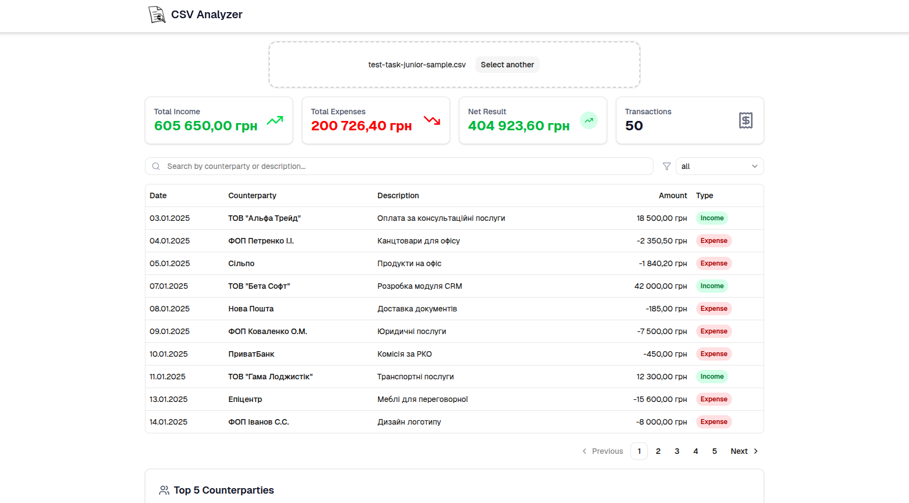

# CSV Analyzer

A modern web application for analyzing CSV files with data validation, visualization, and filtering capabilities. Built with Next.js, TypeScript, and Tailwind CSS.

## Features

- **CSV File Upload**: Drag-and-drop interface for uploading CSV files
- **Data Validation**: Automatic validation of CSV rows with error reporting
- **Data Table**: Interactive table with sorting and pagination
- **Summary Statistics**: Overview cards showing key metrics
- **Invalid Row Detection**: Identifies and displays problematic rows
- **Top Counterparties**: Analysis of most frequent data entries

## Setup Instructions

### Install Dependencies

```bash
npm install
```

### Run Development Server

```bash
npm run dev
```

Open [http://localhost:3000](http://localhost:3000) in your browser to view the application.

## Technology Stack

- **Next.js 16.2.4** - React framework
- **TypeScript** - Type-safe development
- **Tailwind CSS** - Utility-first CSS framework
- **shadcn/ui** - Modern UI components
- **PapaParse** - CSV parsing library
- **Zod** - Schema validation
- **Vitest** - Testing framework
